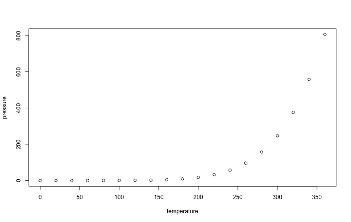

 

## Objectives of the project

## Data set
Load the data from Kaggle.com regarding HR analytics in a major US company

https://www.kaggle.com/ludobenistant/hr-analytics

| satisfaction_level| last_evaluation| number_project| average_montly_hours| time_spend_company| Work_accident| left| promotion_last_5years| Salary| Sales| Accounting| Hr| product_mng| technical| support| IT| product_mng.1| RandD|
|------------------:|---------------:|--------------:|--------------------:|------------------:|-------------:|----:|---------------------:|------:|-----:|----------:|--:|-----------:|---------:|-------:|--:|-------------:|-----:|
|               0.38|            0.53|              2|                  157|                  3|             0|    1|                     0|      0|     1|          0|  0|           0|         0|       0|  0|             0|     0|
|               0.80|            0.86|              5|                  262|                  6|             0|    1|                     0|      1|     1|          0|  0|           0|         0|       0|  0|             0|     0|
|               0.11|            0.88|              7|                  272|                  4|             0|    1|                     0|      1|     1|          0|  0|           0|         0|       0|  0|             0|     0|
|               0.72|            0.87|              5|                  223|                  5|             0|    1|                     0|      0|     1|          0|  0|           0|         0|       0|  0|             0|     0|
|               0.37|            0.52|              2|                  159|                  3|             0|    1|                     0|      0|     1|          0|  0|           0|         0|       0|  0|             0|     0|
|               0.41|            0.50|              2|                  153|                  3|             0|    1|                     0|      0|     1|          0|  0|           0|         0|       0|  0|             0|     0|
|               0.10|            0.77|              6|                  247|                  4|             0|    1|                     0|      0|     1|          0|  0|           0|         0|       0|  0|             0|     0|
|               0.92|            0.85|              5|                  259|                  5|             0|    1|                     0|      0|     1|          0|  0|           0|         0|       0|  0|             0|     0|
|               0.89|            1.00|              5|                  224|                  5|             0|    1|                     0|      0|     1|          0|  0|           0|         0|       0|  0|             0|     0|
|               0.42|            0.53|              2|                  142|                  3|             0|    1|                     0|      0|     1|          0|  0|           0|         0|       0|  0|             0|     0|

## Descriptive statistics

We show the descriptive statistics of the factors

|                      |   min| 25 percent| median|   mean| 75 percent| max|   std|
|:---------------------|-----:|----------:|------:|------:|----------:|---:|-----:|
|satisfaction_level    |  0.09|       0.44|   0.64|   0.61|       0.82|   1|  0.25|
|last_evaluation       |  0.36|       0.56|   0.72|   0.72|       0.87|   1|  0.17|
|number_project        |  2.00|       3.00|   4.00|   3.80|       5.00|   7|  1.23|
|average_montly_hours  | 96.00|     156.00| 200.00| 201.05|     245.00| 310| 49.94|
|time_spend_company    |  2.00|       3.00|   3.00|   3.50|       4.00|  10|  1.46|
|Work_accident         |  0.00|       0.00|   0.00|   0.14|       0.00|   1|  0.35|
|left                  |  0.00|       0.00|   0.00|   0.24|       0.00|   1|  0.43|
|promotion_last_5years |  0.00|       0.00|   0.00|   0.02|       0.00|   1|  0.14|
|Salary                |  0.00|       0.00|   1.00|   0.59|       1.00|   2|  0.64|
|Sales                 |  0.00|       0.00|   0.00|   0.28|       1.00|   1|  0.45|
|Accounting            |  0.00|       0.00|   0.00|   0.05|       0.00|   1|  0.22|
|Hr                    |  0.00|       0.00|   0.00|   0.05|       0.00|   1|  0.22|
|product_mng           |  0.00|       0.00|   0.00|   0.06|       0.00|   1|  0.24|
|technical             |  0.00|       0.00|   0.00|   0.18|       0.00|   1|  0.39|
|support               |  0.00|       0.00|   0.00|   0.15|       0.00|   1|  0.36|
|IT                    |  0.00|       0.00|   0.00|   0.08|       0.00|   1|  0.27|
|product_mng.1         |  0.00|       0.00|   0.00|   0.06|       0.00|   1|  0.24|
|RandD                 |  0.00|       0.00|   0.00|   0.05|       0.00|   1|  0.22|

We need to scale the data (excluding dummy variables for the department)

Notice now the summary statistics of the scaled dataset (excluding dummy variables for the department):

|                      |   min| 25 percent| median| mean| 75 percent|  max| std|
|:---------------------|-----:|----------:|------:|----:|----------:|----:|---:|
|satisfaction_level    | -2.10|      -0.70|   0.11|    0|       0.83| 1.56|   1|
|last_evaluation       | -2.08|      -0.91|   0.02|    0|       0.90| 1.66|   1|
|number_project        | -1.46|      -0.65|   0.16|    0|       0.97| 2.59|   1|
|average_montly_hours  | -2.10|      -0.90|  -0.02|    0|       0.88| 2.18|   1|
|time_spend_company    | -1.03|      -0.34|  -0.34|    0|       0.34| 4.45|   1|
|Work_accident         | -0.41|      -0.41|  -0.41|    0|      -0.41| 2.43|   1|
|left                  | -0.56|      -0.56|  -0.56|    0|      -0.56| 1.79|   1|
|promotion_last_5years | -0.15|      -0.15|  -0.15|    0|      -0.15| 6.78|   1|
|Salary                | -0.93|      -0.93|   0.64|    0|       0.64| 2.21|   1|

Let's see how these are correlated. The correlation matrix is as follows:

|                      | satisfaction_level| last_evaluation| number_project| average_montly_hours| time_spend_company| Work_accident|  left| promotion_last_5years| Salary| Sales| Accounting|    Hr| product_mng| technical| support|    IT| product_mng.1| RandD|
|:---------------------|------------------:|---------------:|--------------:|--------------------:|------------------:|-------------:|-----:|---------------------:|------:|-----:|----------:|-----:|-----------:|---------:|-------:|-----:|-------------:|-----:|
|satisfaction_level    |               1.00|            0.11|          -0.14|                -0.02|              -0.10|          0.06| -0.39|                  0.03|   0.05|  0.00|      -0.03| -0.01|        0.01|     -0.01|    0.01|  0.01|          0.01|  0.01|
|last_evaluation       |               0.11|            1.00|           0.35|                 0.34|               0.13|         -0.01|  0.01|                 -0.01|  -0.01| -0.02|       0.00| -0.01|        0.00|      0.01|    0.02|  0.00|          0.00| -0.01|
|number_project        |              -0.14|            0.35|           1.00|                 0.42|               0.20|          0.00|  0.02|                 -0.01|   0.00| -0.01|       0.00| -0.03|        0.00|      0.03|    0.00|  0.00|          0.00|  0.01|
|average_montly_hours  |              -0.02|            0.34|           0.42|                 1.00|               0.13|         -0.01|  0.07|                  0.00|   0.00|  0.00|       0.00| -0.01|       -0.01|      0.01|    0.00|  0.01|         -0.01|  0.00|
|time_spend_company    |              -0.10|            0.13|           0.20|                 0.13|               1.00|          0.00|  0.14|                  0.07|   0.05|  0.02|       0.00| -0.02|        0.00|     -0.03|   -0.03| -0.01|          0.00| -0.02|
|Work_accident         |               0.06|           -0.01|           0.00|                -0.01|               0.00|          1.00| -0.15|                  0.04|   0.01|  0.00|      -0.01| -0.02|        0.00|     -0.01|    0.01| -0.01|          0.00|  0.02|
|left                  |              -0.39|            0.01|           0.02|                 0.07|               0.14|         -0.15|  1.00|                 -0.06|  -0.16|  0.01|       0.02|  0.03|       -0.01|      0.02|    0.01| -0.01|         -0.01| -0.05|
|promotion_last_5years |               0.03|           -0.01|          -0.01|                 0.00|               0.07|          0.04| -0.06|                  1.00|   0.10|  0.01|       0.00|  0.00|       -0.04|     -0.04|   -0.04| -0.04|         -0.04|  0.02|
|Salary                |               0.05|           -0.01|           0.00|                 0.00|               0.05|          0.01| -0.16|                  0.10|   1.00| -0.04|       0.01|  0.00|       -0.01|     -0.02|   -0.03| -0.01|         -0.01|  0.00|
|Sales                 |               0.00|           -0.02|          -0.01|                 0.00|               0.02|          0.00|  0.01|                  0.01|  -0.04|  1.00|      -0.14| -0.14|       -0.16|     -0.29|   -0.26| -0.18|         -0.16| -0.15|
|Accounting            |              -0.03|            0.00|           0.00|                 0.00|               0.00|         -0.01|  0.02|                  0.00|   0.01| -0.14|       1.00| -0.05|       -0.06|     -0.11|   -0.10| -0.07|         -0.06| -0.05|
|Hr                    |              -0.01|           -0.01|          -0.03|                -0.01|              -0.02|         -0.02|  0.03|                  0.00|   0.00| -0.14|      -0.05|  1.00|       -0.06|     -0.11|   -0.10| -0.07|         -0.06| -0.05|
|product_mng           |               0.01|            0.00|           0.00|                -0.01|               0.00|          0.00| -0.01|                 -0.04|  -0.01| -0.16|      -0.06| -0.06|        1.00|     -0.12|   -0.11| -0.08|          1.00| -0.06|
|technical             |              -0.01|            0.01|           0.03|                 0.01|              -0.03|         -0.01|  0.02|                 -0.04|  -0.02| -0.29|      -0.11| -0.11|       -0.12|      1.00|   -0.20| -0.14|         -0.12| -0.11|
|support               |               0.01|            0.02|           0.00|                 0.00|              -0.03|          0.01|  0.01|                 -0.04|  -0.03| -0.26|      -0.10| -0.10|       -0.11|     -0.20|    1.00| -0.12|         -0.11| -0.10|
|IT                    |               0.01|            0.00|           0.00|                 0.01|              -0.01|         -0.01| -0.01|                 -0.04|  -0.01| -0.18|      -0.07| -0.07|       -0.08|     -0.14|   -0.12|  1.00|         -0.08| -0.07|
|product_mng.1         |               0.01|            0.00|           0.00|                -0.01|               0.00|          0.00| -0.01|                 -0.04|  -0.01| -0.16|      -0.06| -0.06|        1.00|     -0.12|   -0.11| -0.08|          1.00| -0.06|
|RandD                 |               0.01|           -0.01|           0.01|                 0.00|              -0.02|          0.02| -0.05|                  0.02|   0.00| -0.15|      -0.05| -0.05|       -0.06|     -0.11|   -0.10| -0.07|         -0.06|  1.00|

## Dimensionability reduction *(second priority)*

## Cluster Analysis

## Predictive machine learning (artificial stupidity)

## Executive summary and final conclusions

## Including Plots

You can also embed plots, for example:

Note that the `echo = FALSE` parameter was added to the code chunk to prevent printing of the R code that generated the plot.
